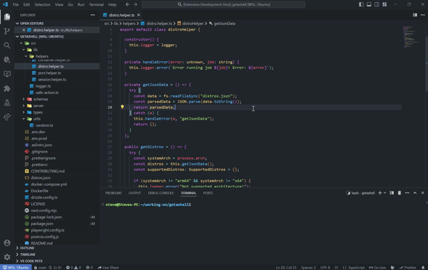

<div align="center">
    <h1>NamingBuddy</h1>
    <p>A simple extension to help you generate class, function and variable names when you just can't think of a good name</p>
    
</div>

### Features 😲

- Generate Variable Name
- Generate Function Name
- Generate Class Name

### Installation ⬇️

You can install the extension by grabbing the `.vsix` file from the release page.

### Building 🛠️

To build you need to install the `vsce` package using:

```bash
npm install -g @vscode/vsce
```

Then you can simply run:

```bash
vsce package
```

You will find the extension in the root folder of the project called `namingbuddy-someversion.vsix`.

### Contributing ❤️

If you want to contribute to the extension you can do so by creating a fork of the project making your changes and openning a pull request. Any help is appreciated.

### License 📜

The project is licensed under the GPL V3 License. You may modify, distribute and copy the code as long as you keep the changes in the source files. Any modifications you make using a compiler must be also licensed under the GPL license and include build and install instructions.
